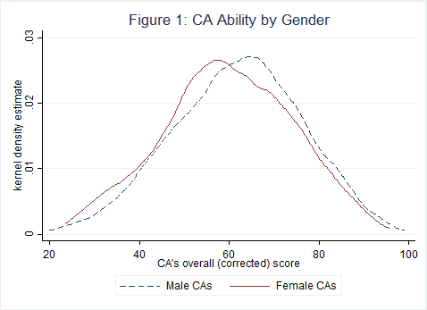
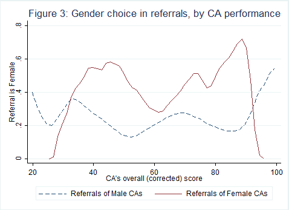
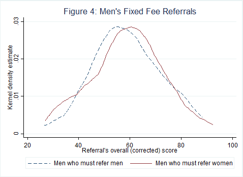
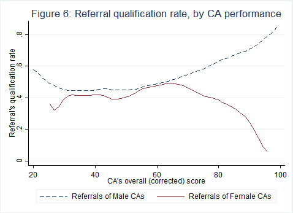
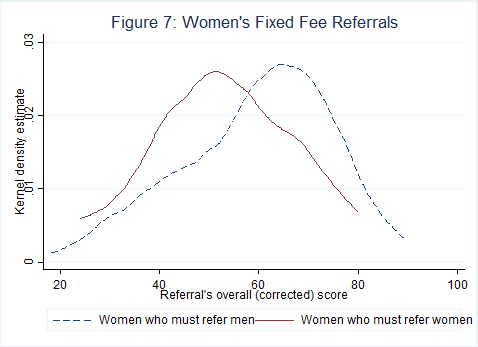
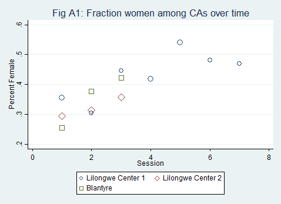
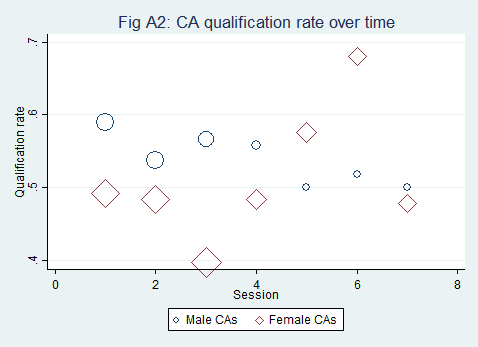
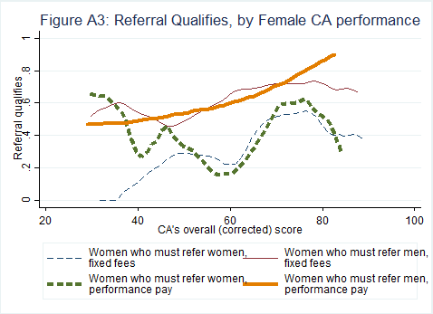

#  Do Job Networks Disadvantage Women? Evidence from a Recruitment Experiment in Malawi Validation and Replication results


SUMMARY
-------

> INSTRUCTION: The Data Editor will fill this part out. It will be based on any [REQUIRED] and [SUGGESTED] action items that the report makes a note of. 

> INSTRUCTION: ALWAYS do "Data description", "Code description". If data is present, ALWAYS do "Data checks". If time is sufficient (initial assessment!), do "Replication steps", if not, explain why not.

Data description
----------------

### Data Sources

This experiment was an RCT and all data were collected primarily from the authors and IPA. 
[All data was made publicly availabe by the authors here](https://www.journals.uchicago.edu/doi/suppl/10.1086/693869)
[There is also a file in the repository](Recruitment_ReplicationData.dta)

#### Example data

- Data is not provided, but a link is provided in the README
- Access conditions are not described. It turns out, the website requires registration and payment of a fee
- The data is not cited in the paper nor in the README.

### Analysis Data Files


- [ ] No analysis data file mentioned
- [ ] Analysis data files mentioned, not provided (explain reasons below)
- [X] Analysis data files mentioned, provided. File names listed below.


```{bash}
find . -name \*.dta
```

Example:

```
./Output_Empirical/data/census_shp/counties_coord.dta
./Output_Empirical/data/census_shp/counties_db.dta
./Output_Empirical/data/census_shp/state_coord.dta
./Output_Empirical/data/census_shp/state_db.dta
```


Data checks
-----------


> Problem (Keep getting error from PII scan)


Code description
----------------

[List of tables and figures](code-check.xlsx)
>There are 7 total tables, all tables are presented in a csv format. Therea are 8 total figures, all of them are in pdf format. All tables and figures are created within the do-file, the do-file creates 2 directories "tables" and "graphs" where the outputs are stored respectively.


Stated Requirements
---------------------


>No requirements were specified by the author, however the data and data analysis files need stata to run.


Actual Requirements, if different
---------------------------------


- [X] Software Requirements 
  - [X] Stata
    - Packages go here
  - [ ] Matlab
  - [ ] R
    - R packages go here
  - [ ] REPLACE ME WITH OTHER
- [ ] Computational Requirements specified as follows:
  - Cluster size, etc.
- [ ] Time Requirements 
  - Approximately 2 minutes

> [REQUIRED] Please amend README to contain complete requirements. 

You can copy the section above, amended if necessary.

Computing Environment of the Replicator
---------------------


- Windows Desktop, Windows 10, 24 GB of memory, Intel i5-8600k @ 3.6GHZ


- Stata/MP 14.2


Replication steps
-----------------

Example:

1. Download the following data and data analysis files. [Data](Recruitment_ReplicationData) [Data Analysis File](bkm_malawi_jole_replication)
2. Download the data and do file in the same directory and run the do file to replicate the study.
3. I added a config.do to track log files for the replication
4. I added code that makes directories in the same directory for the outputs of graphs and tables
5. I added code to install the estout package required to create the tables in csv
6. I have scanned the data for Personal Information Identifiers, none were found
7. I created a READ ME file that reads as these steps do
8. I uploaded this replication within a github repository

Findings
--------


### Data Preparation Code

Examples:

- The do file originally required the replicator to input a directory first.
- The updated do file will run completely if the data file and do file are in the same directory
- The original do file required the replicator to create separately two output sources titled "tables" and "graphs". 
-The updated do file creates these automatically within the directory without the need for the replicator to create new folders.

### Tables

Examples:

- Table 1: The CA is changed to OP in all tables, other than that all values are equal
- Table 2: All values are the same
- Table 3: All values are the same
- Table 4: All values are the same
- Table 5: All values are the same
- Table 6: All values are the same
- Table 1A: All values are the same

### Figures


Example:

- Figure 1: Looks the same
- Figure 2: There is no Figure 2 in the replication code
- Figure 3: Looks the same
- Figure 4: Looks the same
- Figure 5: There is no Figure 5 in the replication code
- Figure 6: Looks the same
- Figure 7: Looks the same
- Figure A1: Looks the same
- Figure A2: Looks the same
- Figure A3: Looks the same

Paper version:


Figure 1 generated by programs:











### In-Text Numbers

There are no in-text numbers, or all in-text numbers stem from tables and figures.


Classification
--------------


> Full reproduction can include a small number of apparently insignificant changes in the numbers in the table. Full reproduction also applies when changes to the programs needed to be made, but were successfully implemented.


- [X] full reproduction
- [ ] full reproduction with minor issues
- [ ] partial reproduction (see above)
- [ ] not able to reproduce most or all of the results (reasons see above)

